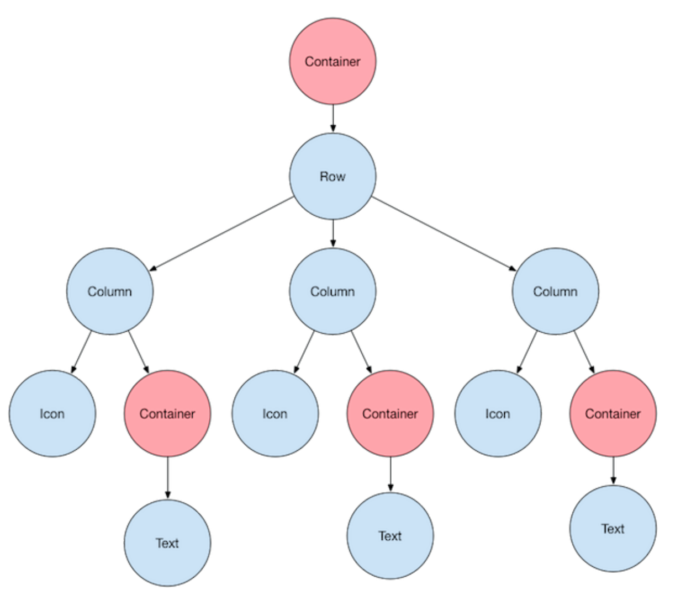
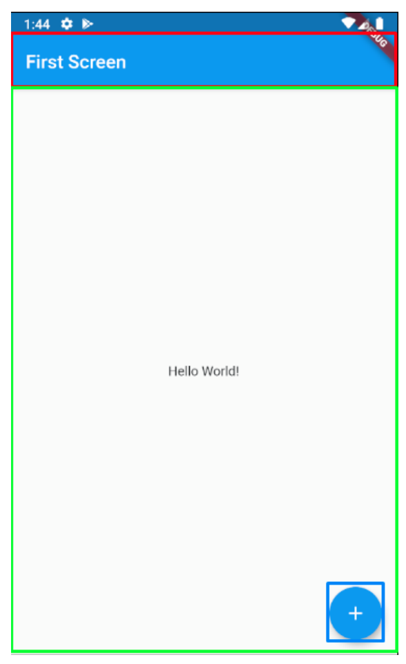
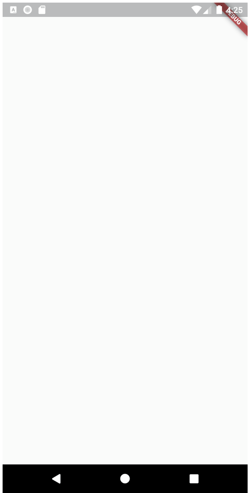

## Latihan - 1

Pada latihan 1 ini kalian akan belajar tentang dasar dari Flutter.
Flutter widget lifecycle, Statefull dan Stateless, Scaffold, AppBar, Impor asset.

Jump to

- [Flutter Widget Tree](https://github.com/dikynugraha1111/bootcamp_uty/tree/master/lib/latihan_1#flutter-widget-tree)
- [Flutter Widget Lifecycle](https://github.com/dikynugraha1111/bootcamp_uty/tree/master/lib/latihan_1#flutter-widget-lifecycle)
- [Stateless dan Statefull](https://github.com/dikynugraha1111/bootcamp_uty/tree/master/lib/latihan_1#Stateless-dan-Statefull)
- [Scaffold](https://github.com/dikynugraha1111/bootcamp_uty/tree/master/lib/latihan_1#Scaffold)
- [AppBar](https://github.com/dikynugraha1111/bootcamp_uty/tree/master/lib/latihan_1#AppBar)
- [Import Asset](https://github.com/dikynugraha1111/bootcamp_uty/tree/master/lib/latihan_1#Import-Asset)

### Flutter Widget Tree

Pada dasarnya Flutter berisikan widget-widget kecil yang menjadi sebuah widget sedang, dan widget-widget sedang menjadi sebuah widget besar, dan begitu seterusnya. Seperti pada contoh berikut, ketika kita ingin membuat layout seperti berikut ini.
 </br>

Jika kita gambarkan dengan diagram maka akan sebagai berikut :
 </br>
Dimana pertama kita akan membuat sebuah Row, lalu di dalam Row tersebut kita berikan beberapa Column, yang dimana setiap Column tersebut berisikan Icon dan Text. Container disini digunakan untuk membungkus beberapa widget guna menambahkan beberapa atribut seperti margin, padding, background, atau semacamnya.

### Flutter Widget Lifecycle

Refrensi :

- https://api.flutter.dev/flutter/widgets/State-class.html
- https://medium.com/flutterdevs/explore-widget-lifecycle-in-flutter-e36031c697d0
- https://medium.com/flutter-communityflutter-lifecycle-for-android-and-ios-developers-8f532307e0c7</br>


#### createState

Berjalan ketika StatefulWidget dibuat atau dibangun, dan method ini harus ada

#### initState

Berjalan sekali dan pertama kali setelah widget dibuat, ini mirip seperti onCreate pada Android. Method ini biasa dibutuhkan untuk initialize variables, data, properties, dan semacamnya

#### build

Ini adalah method yang sangat penting, dimana ini dijalankan setiapkan UI ditampilkan atau dirender

#### setState

Method ini dapat dipanggil kapan saja dan berfungsi untuk merebuild atau menjalankan ulang method build

#### dispose

Method ini juga tidak kalah penting, dimana ini dijalankan ketika widget atau state dihapus permanen. Method ini biasa dibutuhkan untuk unsubscribe streams, dispose animations, dan semacamnya. Method ini adalah kebalikan dari initState

### Stateless dan Statefull

Seperti yang kita tahu jantung dari aplikasi Flutter adalah widgets. Sebagian besar yang ada pada Flutter merupakan widgets. Membuat tombol, menampilkan gambar, text, dan membuat tampilan berada di tengah pada Flutter semuanya menggunakan widget. Kita juga dapat membuat widget sendiri untuk dapat digunakan lain waktu ataupun dibagikan kepada Flutter developer lain (dalam bentuk packages).
Widget pada Flutter memiliki dua jenis, yaitu StatelessWidget dan StatefulWidget. Sebagai developer Flutter, kita harus memahami betul kedua jenis widget tersebut, maka pada bagian ini kita akan mempelajari apa itu StatelessWidget dan StatefulWidget.

#### Apa itu state ?

Untuk teman-teman dengan background frontend web developer, tentu tak akan asing dengan istilah State ini, terutama menggunakan framework ReactJS. Tetapi untuk Anda tanpa background tersebut tidak perlu risau. State tidaklah sulit untuk dimengerti. Jadi State adalah data yang ada pada suatu widget. Widget menyimpan data yang nantinya dapat berubah sesuai interaksi pengguna.

Karena Flutter menggunakan paradigma OOP (Object Oriented Programming), state biasanya
menjadi suatu properti dari sebuah class. Contohnya sebagai berikut:

```class MyApp extends StatelessWidget {
  const MyApp({super.key});
```

#### StatelessWidget

Setelah mengenal apa itu state, maka yang pertama kita akan bahas adalah StatelessWidget. StatelessWidget adalah widget yang nilai state-nya tidak dapat berubah (immutable) maka
widget tersebut lebih bersifat statis dan memiliki interaktivitas yang terbatas.

#### StatefullWidget

Kebalikan dari StatelessWidget, StatefulWidget ialah widget yang state-nya dapat berubah-ubah nilainya, yang berarti StatefulWidget bersifat dinamis dan memiliki interaksi yang tak terbatas.

### Scaffold

Scaffold merupakan sebuah widget yang digunakan untuk membuat tampilan dasar material design pada aplikasi Flutter, yang dapat disebut juga dasar sebuah halaman pada aplikasi Flutter.</br>

Pada gambar di atas kotak berwarna merah merupakan AppBar; kotak berwarna hijau
merupakan body; dan kotak berwarna biru merupakan FloatingActionButton.

Untuk membuat sebuah Scaffold kita hanya cukup memanggil class Scaffold seperti berikut:

```class FirstScreen extends StatelessWidget {
  @override
  Widget build(BuildContext context) {
    return Scaffold();
  }
}
```

Pada kode diatas kita membuat sebuah StatelessWidget bernama FirstScreen, yang merupakan widget tampilan kita. Kemudian di dalam method build kita panggil Scaffold. Ketika kita menjalankan aplikasi Flutter, pada layar akan hanya muncul tampilan berwarna putih.</br>


### AppBar

Setelah kita membuat Scaffold pertama kita pada Widget FirstScreen, sekarang kita akan menambahkan AppBar pada Scaffold. Seperti yang kita tahu AppBar merupakan Header (bagian paling atas) aplikasi atau biasa dikenal dengan toolbar. Pada AppBar umumnya terdapat judul dan ActionButton.
class FirstScreen extends StatelessWidget {

```@override
Widget build(BuildContext context) {
  return Scaffold(
    appBar: AppBar(
      title: Text('First Screen'),
    ),
  );
}
```

Pada kode di atas kita menambahkan parameter appBar pada Scaffold dan menambahkan title pada AppBar tersebut. Title di sini tidak hanya spesifik Text saja, melainkan juga dapat diisi dengan widget lainnya seperti TextField untuk kolom pencarian atau yang lainnya. Setelah menambahkan kode di atas, coba refresh atau hot reload aplikasi flutter Anda. Selain menambahkan title kita dapat menambahkan widget-widget actions

### Import Asset

Untuk melakukan import asset pada flutter cukup mudah dilakukan. Import asset digunakan untuk kita bisa memasukan asset / file seperti gambar, icon, file dsb dan dipanggil pada project flutter kita untuk digunakan pada aplikasi yang berjalan.
Kita cukup mendefinisikan file yang ingin kita import di bagian pubspec.yaml.

```
# To add assets to your application, add an assets section, like this:
  assets:
    - asset/
```

Pada contoh diatas kita akan melakukan import kepada semua file yang terdapat di folder asset.
Selain melakukan import dengan semua file, kita juga bisa melakukan import pada file spesifik yang ingin kita gunakan saja dengan mendefinisikannya sebagai berikut :

```
# To add assets to your application, add an assets section, like this:
  assets:
    - asset/raw/flutter_lifecycle.png
```

Pada code diatas kita akan melakukan import pada file flutter_lifecycle.png.
