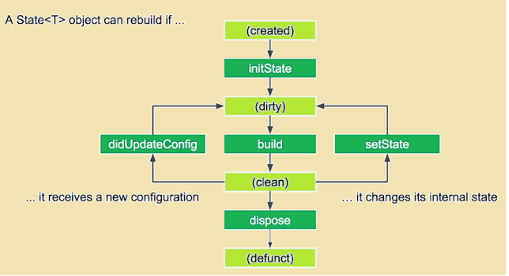

## Latihan - 1

Pada latihan 1 ini kalian akan belajar tentang dasar dari Flutter.
Flutter widget lifecycle, Statefull dan Stateless, Scaffold, AppBar, Impor asset.

### Flutter Widget Tree

Pada dasarnya Flutter berisikan widget-widget kecil yang menjadi sebuah widget sedang, dan widget-widget sedang menjadi sebuah widget besar, dan begitu seterusnya. Seperti pada contoh berikut, ketika kita ingin membuat layout seperti berikut ini.
  

Jika kita gambarkan dengan diagram maka akan sebagai berikut :
  
Dimana pertama kita akan membuat sebuah Row, lalu di dalam Row tersebut kita berikan beberapa Column, yang dimana setiap Column tersebut berisikan Icon dan Text. Container disini digunakan untuk membungkus beberapa widget guna menambahkan beberapa atribut seperti margin, padding, background, atau semacamnya.

### Flutter Widget Lifecycle

Refrensi :

- https://api.flutter.dev/flutter/widgets/State-class.html
- https://medium.com/flutterdevs/explore-widget-lifecycle-in-flutter-e36031c697d0
- https://medium.com/flutter-communityflutter-lifecycle-for-android-and-ios-developers-8f532307e0c7 

#### createState

Berjalan ketika StatefulWidget dibuat atau dibangun, dan method ini harus ada

#### initState

Berjalan sekali dan pertama kali setelah widget dibuat, ini mirip seperti onCreate pada Android. Method ini biasa dibutuhkan untuk initialize variables, data, properties, dan semacamnya

#### build

Ini adalah method yang sangat penting, dimana ini dijalankan setiapkan UI ditampilkan atau dirender

#### setState

Method ini dapat dipanggil kapan saja dan berfungsi untuk merebuild atau menjalankan ulang method build

#### dispose

Method ini juga tidak kalah penting, dimana ini dijalankan ketika widget atau state dihapus permanen. Method ini biasa dibutuhkan untuk unsubscribe streams, dispose animations, dan semacamnya. Method ini adalah kebalikan dari initState
