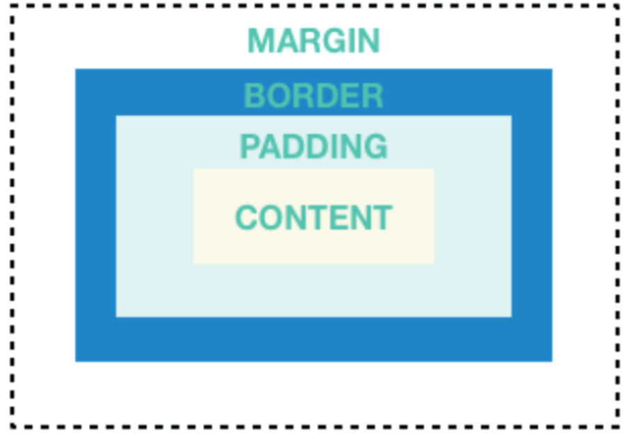
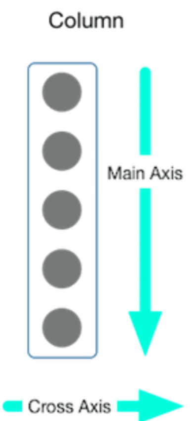
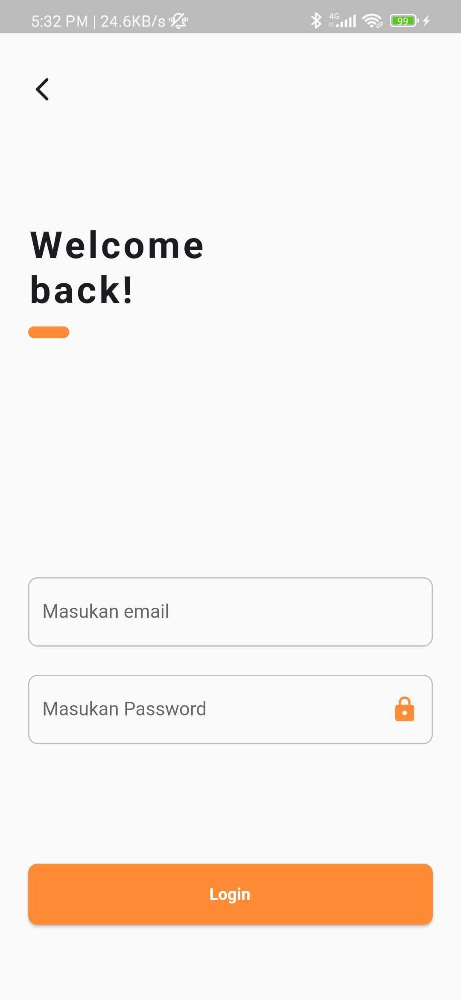

## Latihan - 2

Pada pelatihan 2 ini akan membahas tentang widget lanjutan dari materi sebelumnya.
Untuk latihan 2 akan membahas tentang Text, container, Center, TextField, dan Button

Jump to

- [Container](https://github.com/dikynugraha1111/bootcamp_uty/tree/master/lib/latihan_2#Container)
- [Text](https://github.com/dikynugraha1111/bootcamp_uty/tree/master/lib/latihan_2#Text)
- [Center](https://github.com/dikynugraha1111/bootcamp_uty/tree/master/lib/latihan_2#Center)
- [TextField](https://github.com/dikynugraha1111/bootcamp_uty/tree/master/lib/latihan_2#Text-Field)
- [Button](https://github.com/dikynugraha1111/bootcamp_uty/tree/master/lib/latihan_2#Button)
- [Column](https://github.com/dikynugraha1111/bootcamp_uty/tree/master/lib/latihan_2#Column)
- [Refrensi](https://github.com/dikynugraha1111/bootcamp_uty/tree/master/lib/latihan_2#Refrensi)
- [Task](https://github.com/dikynugraha1111/bootcamp_uty/tree/master/lib/latihan_2#Task)

### Container

Container adalah widget dasar dari beberapa widget yang ada, di widget ini kita dapat mengatur seperti alignment, padding, margin, background, color, width, height, border, dan lain sebagainya.</br>

Beberapa parameter yang akan sering digunakan seperti,
alignment, berfungsi untuk mengatur alignment dari child widget tersebut
padding, berfungsi untuk mengatur padding dari child widget tersebut, padding sendiri adalah jarak dari content atau child ke border
margin, berfungsi untuk mengatur margin dari child widget tersebut, margin sendiri adalah jarak dari content atau child ke parent
color, berfungsi untuk memberikan warna pada background widget tersebut, dan perlu dicatat jika kamu menggunakan properties decoration, maka kamu tidak boleh menggunakan color yang ada pada Container ini
width, berfungsi untuk mengatur ukuran lebar dari widget tersebut
height, berfungsi untuk mengatur ukuran tinggi dari widget tersebut
decoration, brefungsi untuk setting an lebih lanjut terhadapt widget container seperti image, shape, border, borderRadius, dsb.
contoh :

```
Container(
    alignment: Alignment.center,
    padding: EdgeInsets.all(8.0),
    width: 56.0,
    height: 56.0,
    margin: EdgeInsets.all(8.0),
    child: FlutterLogo(),
    decoration: BoxDecoration(
        color: Colors.blue,
        border: Border.all(),
    ),
);
```

### Text

Salah satu widget yang akan sering kita pakai, dimana widget ini berfungsi untuk menampilkan sebuah teks, namun sayangnya widget ini tidak memiliki properties untuk padding maupun margin, jadi jika ingin menambahkan margin atau padding pada suatu Text, kita harus membungkusnya dengan widget Padding atau Container.
Beberapa properties yang biasa digunakan antara lain,
textAlign, berfungsi untuk mengatur alignment pada teks tersebut
overflow, berfungsi untuk mengatur penanganan jika teks overflow, atur juga properties
maxLines, berfungsi untuk mengatur panjang maksimal dari widget tersebut
textStyle, berfungsi untuk mengatur style dari text seperti font type, size, color dsb.
textDecoration, berfungsi untuk mengubah bentuk dari font seperti itali dan underline.
Contoh :

```
Text(
    'Hello World',
    textAlign: TextAlign.center,
    softWrap: false,
    overflow: TextOverflow.fade,
    maxLines: 1,
);
```

### Center

Sesuai namanya, widget Center berfungsi untuk membuat widget yang ada pada child nya berada di tengah. Widget ini juga akan sering digunakan dalam penerapannya.
Contoh :

```
Center(
    child : Text(
        "Hello World",
        maxLines: 1,
    )
)
```

### Column

Column adalah salah satu widget yang dapat menampung beberapa child sekaligus, atau yang kita sebut sebagai children. Widget ini akan membuat para children nya berjejer berurutan secara vertikal atau atas ke bawah.</br>
</br>
Pada widget ini terdapat properties mainAxisSize yang berfungsi untuk mengatur ukuran dari Column tersebut, by default ini akan berisikan max yang dimana artinya ukurannya akan mengikuti ukuran dari si parent nya, sedangkan jika kita atur menjadi min maka ukurannya akan mengikuti ukuran dari para children nya itu sendiri, ini sama halnya seperti match_parent dan wrap_content pada Android.

```
    Column(
        mainAxisSize: MainAxisSize.min,
        mainAxisAlignment: MainAxisAlignment.center,
        crossAxisAlignment: CrossAxisAlignment.start,
        children: <Widget>[
            FlutterLogo(size: 24),
            FlutterLogo(size: 36),
            FlutterLogo(size: 28),
            FlutterLogo(size: 20),
            FlutterLogo(size: 32),
        ],
    );
```

#### MainAxisAlignment

Properties ini berfungsi untuk mengatur alignment para children secara vertikal untuk Column dan secara horizontal untuk Row, mudahnya dia mengikuti direksi utama dari widget tersebut, pada Column adalah vertikal atau atas ke bawah dan Row secara horizontal atau kiri ke kanan.

#### CrossAxisAlignment

Properties ini adalah berkebalikan dari mainAxisAlignment, yaitu jika mainAxisAlignment pada Column untuk secara vertikal atau atas ke bawah, maka properties ini akan mengatur secara horizontal atau kiri ke kanan.

### Text Field

Sama seperti component pada umumnya seperti di web, android native dsb. Text Field disini digunakan untuk user melakukan inputan text. Pada Flutter setidaknya kita bisa menggunakan TextField ataupun TextFormField.
Keduanya sama sama berbentuk text field, hanya saja untuk TextFormField nanti kita bisa memasukan widget Form sebagai pembungkus dari pada Text Field tersebut.
Nah.... Form itu sendiri bisa kita manfaatkan diantaranya sebagai validator text, on save text, dsb.

```
            Form(
            key: textKey,
            child: TextFormField(
              controller: textController,
              maxLength: 30,
              cursorColor: Colors.greenAccent,
              decoration: InputDecoration(
                labelText: "Masukan Username",
                floatingLabelStyle: const TextStyle(
                  color: Colors.greenAccent,
                  fontWeight: FontWeight.bold,
                ),
                hintText: "Silahkan isi username kamu !",
                suffixIcon: const Icon(Icons.lock),
                suffixIconColor: Colors.greenAccent,
                enabledBorder: OutlineInputBorder(
                  borderRadius: const BorderRadius.all(Radius.circular(8)),
                  borderSide: BorderSide(
                    width: 1.0,
                    color: Colors.grey[400]!,
                  ),
                ),
                focusedBorder: const OutlineInputBorder(
                  borderRadius: BorderRadius.all(Radius.circular(8)),
                  borderSide: BorderSide(
                    width: 1.0,
                    color: Colors.greenAccent,
                  ),
                ),
              ),
              validator: (vlaue) {
                return null;
              },
            ),
          ),
```

### Button

Selanjutnya adalah button. Pada button sendiri kita akan mempelajari menggunakan ElevatedButton. Pada elevetaed button sendiri sama seperti button pada umumnya, digunakan untuk interaksi klik pada user.
Untuk button di flutter sendiri kita juga bisa melakukan kostumasi bentuk mulai dari shape, warna, dsb pada button tersebut. Ataupun kita ingin membuat button sendiri dengan memanfaatkan widget Container juga bisa dilakukan.

```
        ElevatedButton(
          onPressed: () {
            setState(() {
              textButton = "Dharrr";
            });
          },
          style: ElevatedButton.styleFrom(
            padding: const EdgeInsets.all(12.0),
            backgroundColor: Colors.greenAccent,
            shape: RoundedRectangleBorder(
                borderRadius: BorderRadius.circular(8.0)),
          ),
          child: Text(textButton),
        ),
```

### Refrensi

Refrensi yang bisa kalian baca seputar widget :

#### Widget Container

https://api.flutter.dev/flutter/widgets/Container-class.html
https://medium.com/jlouage/container-de5b0d3ad184
https://jagongoding.com/android/flutter/dasar/container/

#### Widget Text

https://api.flutter.dev/flutter/widgets/Text-class.html
https://belajarflutter.com/flutter-widget-memahami-penggunaan-text-widget/

#### Widget Center

https://api.flutter.dev/flutter/widgets/Center-class.html

#### Widget ElevatedButton

https://api.flutter.dev/flutter/material/ElevatedButton-class.html
https://www.woolha.com/tutorials/flutter-using-elevatedbutton-widget-examples

#### Beberapa referensi dalam bentuk artikel atau teks yang berisikan materi Button Widget

https://flutter.dev/docs/development/ui/widgets/material
https://flutter.dev/docs/release/breaking-changes/buttons
https://material.io/components/buttons/flutter

#### Widget Column

https://api.flutter.dev/flutter/widgets/Column-class.html
https://medium.com/jlouage/flutter-row-column-cheat-sheet-78c38d242041
https://www.woolha.com/tutorials/flutter-using-column-widget-examples
https://www.geeksforgeeks.org/row-and-column-widgets-in-flutter-with-example/

### Task

Buatlah sebuah layout UI seperti pada gambar dibawah ini.
Dengan menambahkan fitur validasi pada form dan juga keselarasan halaman UI akan menjadi nilai tambah.</br>
</br>
