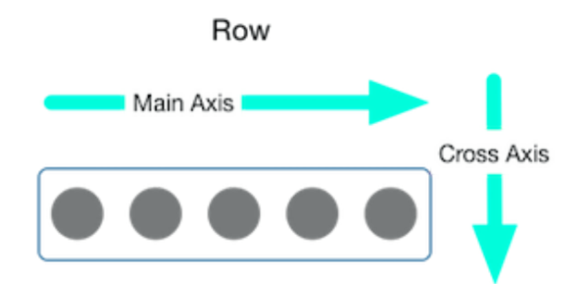
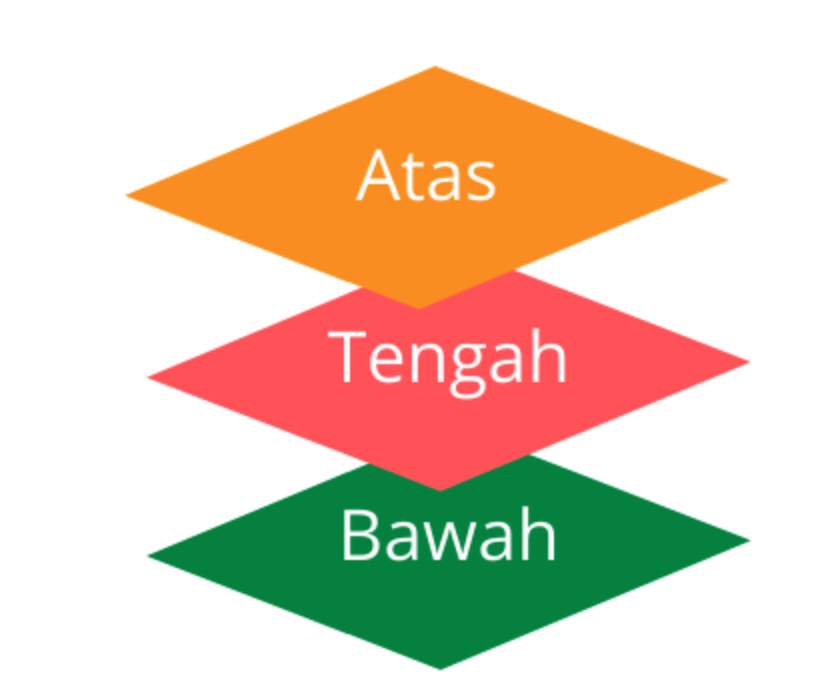
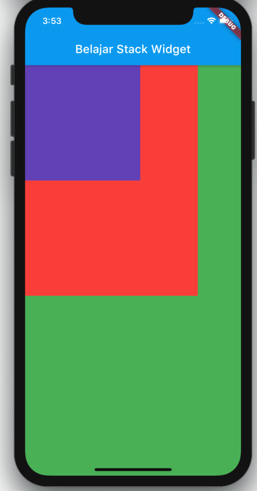

## Latihan 3

Pada pelatihan 3 ini akan membahas tentang widget lanjutan dari materi sebelumnya.
Untuk latihan 3 akan membahas tentang row, column, list view, stack, Navigation (In line code)

Jump to

- [Row](https://github.com/dikynugraha1111/bootcamp_uty/tree/master/lib/latihan_3#Row)
- [List View](https://github.com/dikynugraha1111/bootcamp_uty/tree/master/lib/latihan_3#List-View)
- [Stack](https://github.com/dikynugraha1111/bootcamp_uty/tree/master/lib/latihan_3#Stack)
- [Navigation]()

### Row

Widget ini sama hal nya dengan Column, namun jika Column berdirektori horizontal atau atas ke bawah, maka Row berdirektori utama vertikal atau kiri ke kanan.</br>
</br>

### List View

Cara penggunaan ListView ini mirip dengan Column atau Row di mana Anda memasukkan widget yang ingin disusun sebagai children dari ListView.
Hanya saja untuk widget List View sendiri anda bisa melakukan kustomisasi lebih detail dan banyak lagi, seperti menambahkan separator pada setiap item list view, direction dari list view, generate list view dari item, dan masih banyak lagi.
Disini kita akan membahas 2 macam list view, yaitu List View secara secara default (ListView) dan juga List View yang itemnya di generate dari list data tertentu (ListView.builder atau ListView.generate)

### Stack

Stack widget memungkinkan kita untuk menampilkan beberapa lapis widget ke layar. Stack widget juga merupakan multiple children widget yang artinya memiliki properti children sehingga dapat menampung lebih dr satu widget. Urutan dari lapisan widget pada stack dari bawah ke atas, jadi widget yang pertama di dalam stack akan berada di posisi paling bawah dan begitu juga sebaliknya, widget yang terakhir di stack widget akan berada di posisi paling atas stack.</br>
</br>

```
        body: Stack(
          children: <Widget>[
            Container(
              color: Colors.green,
            ),
            Container(
              color: Colors.red,
              height: 400.0,
              width: 300.0,
            ),
            Container(
              color: Colors.deepPurple,
              height: 200.0,
              width: 200.0,
            ),
          ],
        ),
```

</br>
